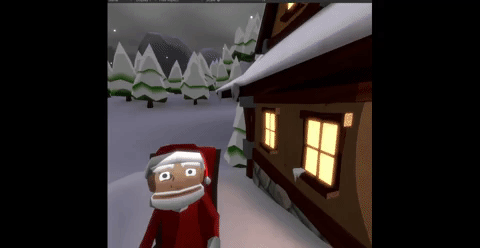
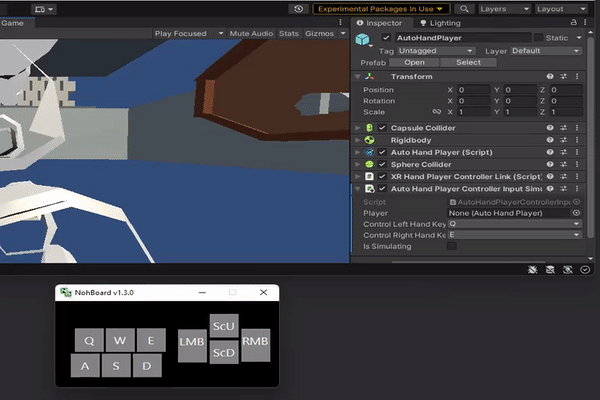
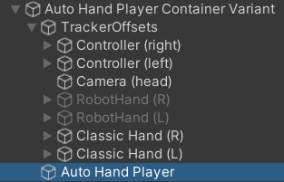
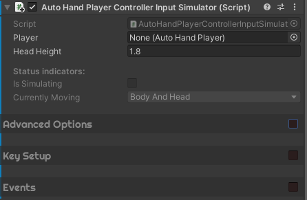
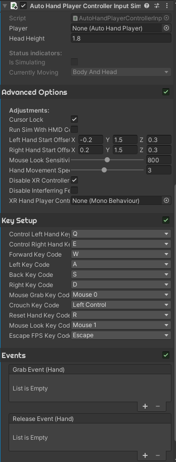

# AutoHandSimulator
A keyboard/mouse input to simulate movement and hand controls for the [AutoHand](https://assetstore.unity.com/packages/tools/physics/auto-hand-vr-physics-interaction-165323) package for Unity.
This script simulates hardware input (i.e., tracking inputs from XR devices). Therefore, it is equivalent to picking up your device and testing it that way, making it a good tool for debugging without having to put on your HMD.

 

(Do you like the looks of it? - it's a work in progress. Follow me on [twitter](https://twitter.com/MTrobotics?ref_src=twsrc%5Etfw) , I will be sharing more about this game in the coming months :-) )

## Update! - Now includes hand control and improved controls!

 

To control hands, simply hold down Q for left hand and E for right hand and move the mouse, to move the hands up/down/left/right and scroll to move forward/backwards.

# Setup
* Setup [AutoHand](https://assetstore.unity.com/packages/tools/physics/auto-hand-vr-physics-interaction-165323) for Unity.
* Copy `Assets` folder into your project
* Make sure that MockHMD and either `Oculus` or `OpenXR` is enabled: `Go to Edit -> Project Settings-> XR Plug-in Management` and enable them. If using OpenXR, make sure to disable Mock Runtime if enabled.
* Using the default XRPlayer, attach the `Assets/AutoHand/Scripts/DebugTools/AutoHandPlayerControllerInputSimulator.cs` to **AutoHandPlayer**.
* Press play! There are no references required

* If using unity version **2021.2.12f1** or newer, make sure to enable the old input handler: `Go to Edit` -> `Project Settings` -> `Player` -> Under `Other Settings` under `Configuration` is the option `Active Input Handling`. Select `Both`.

The script should(!) detect whether the Mock HMD / OpenXR is used and if an HMD is **NOT** attached, and only be effective, if those conditions are met. 
If that is **NOT** the case, the code will simply not run. 
Also, it is using pre-processor directives, so it won't compile for build versions, i.e. you should be able to just leave it there, even for a build version.

## Prerequisites
Requires: 
* The Mock HMD from unity (get the Mock HMD here: https://docs.unity3d.com/Packages/com.unity.xr.mock-hmd@1.0/manual/index.html) and the OpenXR (the default in the standard VR template) or the Oculus plugin.
* The "old" input system from unity, which is the default for Autohand (AFAIK).
* The [AutoHand](https://assetstore.unity.com/packages/tools/physics/auto-hand-vr-physics-interaction-165323) package

## Controls
Controls can be rebound to different key-bindings

- W,A,S,D -> Body movement
- HOLD Q-> Left hand movement
- HOLD E -> Right hand movement
- HOLD E + Q -> Both hands movement
- R -> Reset hands to default position
- HOLD Q + LMB -> grab with left
- HOLD E + LMB -> grab with right
- HOLD Q + HOLD E + LMB -> grab with both hands
- ESC or RMB -> unlock cursor from gameview

## Settings

## Contributions

New to old:
- HotFix for OpenXR freeze frame issue -> [MThogersen](https://github.com/MThogersen)
    - OpenXR did not work as intended when an HMD was running (AutohandSim didn't turn off, resulting in the first frame being frozen), this fix removes a check in the beginning of the code which eliminates this problem. Tested 20/04/2022 in Unity 2021.2.16f.
    - Removed option to run simulator while running an HMD as this was never properly implemented
---
- Updated default controls -> [MThogersen](https://github.com/MThogersen)
    - Changed the default control mode to lock the cursor to the game view (FPS style control) until either: ESC is pressed or the LMB is pressed
    - Original control mode (with no cursor lock) is made available through "Cursor Lock" option.
---
- Refactor and compatibility update -> [MThogersen](https://github.com/MThogersen)
    - Added support for OpenXR's Mock HMD
    - Exposed several settings for more customization
    - Exposed all keyCodes so all buttons can be remapped
    - New enhanced inspector using the familiar Autohand style
    - Exposed grab/release events for further customization
    - Disabled First Person view for now
---
- Merged branch from [0x78f1935](https://github.com/0x78f1935) into main
---
- Refactor -> [0x78f1935](https://github.com/0x78f1935)
    - Changed the way hands move (by raycast)
    - Added First Person view
    - Fixed grab functionality
    - Added reset keybinding
    - Added crouch keybinding
---
- Base Code / idea -> [MThogersen](https://github.com/MThogersen)
    - Initial commit
---